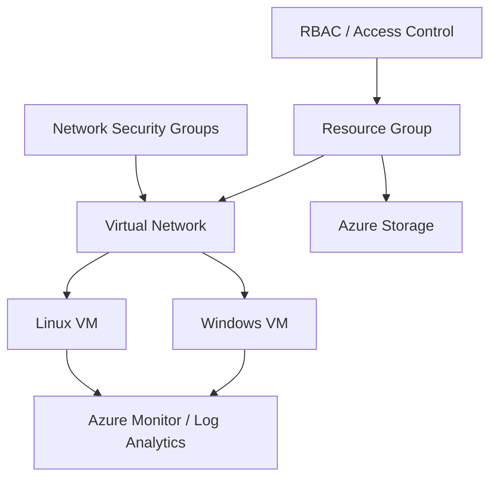

# Microsoft Azure Cloud Infrastructure Lab

**Type:** Hands-on academic lab  
**Environment:** Microsoft Azure  
**Focus:** Compute, networking, access control, storage, and monitoring

## Overview

A hands-on Azure learning environment covering Windows/Linux virtual machines, virtual networking, security controls, access management, storage, and operational monitoring.

## Objective

Build practical familiarity with how compute, networking, permissions, storage, and monitoring work together in a manageable cloud environment.

## Architecture

## Technologies

Microsoft Azure · Virtual Machines · Virtual Networks · NSGs · RBAC · Azure Storage · Azure Monitor · Log Analytics · Windows · Linux

## Implementation

- Worked with Windows and Linux Azure virtual-machine scenarios.
- Practised Virtual Network and Network Security Group concepts.
- Applied RBAC and governance concepts to understand least-privilege access.
- Worked with Azure Storage, Azure Monitor, and Log Analytics concepts.

## Troubleshooting approach

Cloud troubleshooting was separated into layers: resource state, network reachability, NSG rules, operating-system state, permissions/RBAC, and monitoring data.

## Validation

This case study represents academic hands-on work. It does not claim ownership of production subscriptions, customer workloads, or undocumented deployment results.

## What I learned

A cloud VM is only one part of an operational service. Networking, identity, permissions, storage, and monitoring all affect whether the environment is secure, reachable, and supportable.

## Link

- [Portfolio case study](https://devanshujamwal.github.io/Devanshujamwal/projects/azure-infrastructure/)
