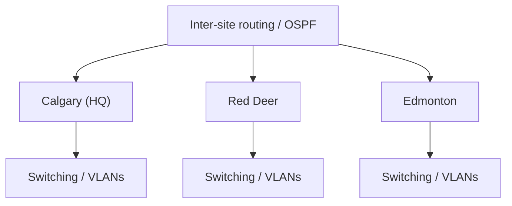

# Enterprise Multi-Site Network Infrastructure

**Type:** Academic project / hands-on lab  
**Environment:** Cisco Packet Tracer  
**Focus:** Networking, addressing, routing, switching, and services

## Overview

An academic multi-site network infrastructure project. My documented contribution focused on Site 3 IPv4/IPv6 addressing and network documentation, while the full project demonstrates how routed sites, switching, addressing, and common network services work together.

## Objective

Connect multiple sites and document how addressing, routing, and local services support end-to-end connectivity.

## Architecture

## Technologies

Cisco Packet Tracer · TCP/IP · IPv4 · IPv6 · VLSM · VLANs · OSPF · DHCP · NAT · DNS

## Implementation

- Designed and documented Site 3 addressing from the assigned `10.9.0.0/18` space using VLSM.
- Documented IPv6 global-unicast, link-local, and default-gateway assignments.
- Worked within a broader routed design combining switching, routing, and common infrastructure services.

## Troubleshooting

The project reinforced a layer-by-layer approach: verify host addressing and gateways first, then interface/VLAN state, routing, and finally higher-level services.

A documentation review also found a gateway/interface inconsistency in the Site 3 report. I present it as a documentation discrepancy rather than claiming an unverified live fault.

## Validation

The original Packet Tracer file and project documentation are preserved in the source repository. I avoid inventing command output that is not preserved in the project material.

## What I learned

The project strengthened my understanding of subnet planning, addressing consistency, routed connectivity, and the importance of accurate documentation during troubleshooting.

## Links

- [Source repository](https://github.com/Devanshujamwal/Network-Design-Company-Infrastructure-Implementation)
- [Portfolio case study](https://devanshujamwal.github.io/Devanshujamwal/projects/enterprise-network/)
