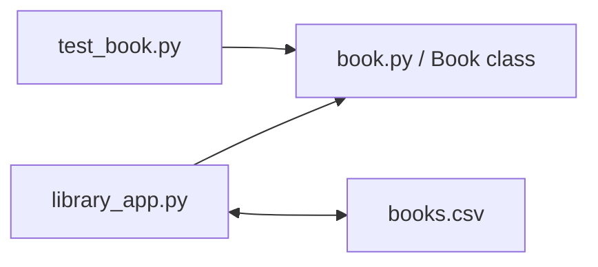

# Python Library Management System

**Type:** Academic software project · three-person team  
**Environment:** Python  
**Focus:** OOP, file I/O, debugging, testing, and collaborative development

## Overview

A command-line Python application built around a `Book` class and catalogue operations. The original academic repository has been refreshed for portfolio presentation with clearer documentation, a functional menu flow, explicit catalogue persistence, and repeatable Book-model checks.

## Objective

Apply object-oriented programming to library records and build a small application for loading, viewing, borrowing, returning, adding, removing, and saving books.

## Architecture

## Technologies

Python · OOP · File I/O · Input validation · Debugging · Assertions · Git/GitHub

## Implementation

- `book.py` encapsulates ISBN, title, author, genre, and availability.
- `library_app.py` handles catalogue loading/saving and the CLI workflow.
- `test_book.py` provides repeatable assertions for the Book model.
- The repository includes a small `books.csv` sample for local testing.

## Troubleshooting and refresh

The original application stored the selected catalogue filename in local scope and later referenced it outside that scope during saving. The refreshed version passes the filename explicitly, giving load/save operations a consistent source of truth.

## What I learned

The project reinforced encapsulation, clear data flow, file handling, debugging, repeatable testing, and the value of clear ownership in a shared codebase.

## Links

- [Source repository](https://github.com/Devanshujamwal/Library-management-system)
- [Portfolio case study](https://devanshujamwal.github.io/Devanshujamwal/projects/python-library-system/)
