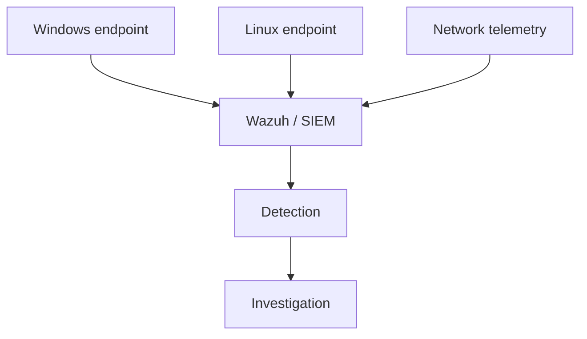

# Security Monitoring & Threat Detection Lab

**Type:** Hands-on cybersecurity lab  
**Environment:** Windows / Linux  
**Focus:** Endpoint visibility, SIEM fundamentals, network context, and investigation reasoning

## Overview

A cybersecurity learning lab focused on Windows/Linux events, Wazuh and SIEM fundamentals, network telemetry, and the investigation process behind security alerts.

## Objective

Understand how endpoint and network telemetry becomes useful investigation context and why an alert must be validated before it is treated as a confirmed incident.

## Architecture

## Technologies

Wazuh · SIEM fundamentals · Windows · Linux · Wireshark · Palo Alto concepts · MITRE ATT&CK concepts

## Implementation

- Worked with Windows/Linux security-event and endpoint-monitoring concepts.
- Used Wazuh/SIEM concepts to understand centralized event collection and review.
- Used Wireshark and firewall coursework concepts to add network context to endpoint observations.
- Focused on timestamps, source systems, and related activity before drawing conclusions.

## Troubleshooting approach

Before interpreting a missing or unexpected event, verify the collection path: endpoint state, agent/source availability, timestamps, ingestion, and related network/security context.

## Validation

This is cybersecurity lab work, not professional SOC experience. The case study intentionally avoids fabricated alerts, detection metrics, or incident outcomes.

## What I learned

Security alerts need context. Reliable investigation depends on telemetry quality, endpoint information, network evidence, and a repeatable troubleshooting process.

## Link

- [Portfolio case study](https://devanshujamwal.github.io/Devanshujamwal/projects/security-monitoring/)
